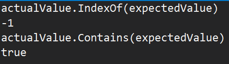

# Mind Your Strings with .NET 5.0

In the process of upgrading a library to support .NET 5.0, I ran into a rather bizarre test failure. Simply by adding a new target of net5.0 in the library and unit tests, single test started to fail. It was absolutely baffling to me, leading my to think that I may have somehow broken strings. Instead, I got to learn waaaaaay more about strings, Unicode, and comparison strategies than I ever really cared to.

But for those migrating to .NET 5.0, you'll want to mind your string methods quite closely.

## The Faulty Assertion
It started off with a test failure:
```csharp
[Test]
public void TestDetailOneGroupTwoClassesSupported()
{
    //SETUP
    MasterEnvironment.ResetLogging();
    var classLog1 = new ClassLog(@"TestGroup01UnitTestGroup\Test01MyUnitTest1");
    MasterEnvironment.AddClassLog(classLog1);
    example2Supported.ForEach(classLog1.MethodLogs.Add);
    var classLog2 = new ClassLog(@"TestGroup01UnitTestGroup\Test01MyUnitTest2");
    MasterEnvironment.AddClassLog(classLog2);
    example2Supported.ForEach(classLog2.MethodLogs.Add);

    //ATTEMPT
    var markup = MasterEnvironment.ResultsAsMarkup(OutputVersions.Detail);

    //VERIFY
    markup.ShouldStartWith("Detail");
    markup.ShouldContain("Group: Unit Test Group");
    markup.ShouldContain("\n#### [My Unit Test1](");
    markup.ShouldContain("\n#### [My Unit Test2]("); // <- this blew up
    markup.ShouldContain("\n- Supported\n  * Good1 (line 1)\n  * Good2 (line 2)");
}
```
The next to last assertion blew up on .NET 5.0 but worked on all other platforms tested (.NET Core 2.0, 3.0, 3.1, .NET 4.5). I first verified that the value to test was exactly the same (it was), then looked at the assertion. This library uses NUnit, and eventually makes a comparison using string.IndexOf(value, StringComparison.CurrentCulture). As I was debugging, I put the values into the watch window and got some rather strange results:


Well that's a bit disconcerting - I ask "do you contain this value". "Yes". "Where". "I dunno". How can this be? I went back to .NET Core 3.1, and saw that the two methods were consistent, it said the value was contained AND it found the right place.

So I didn't break strings, but SOMETHING was different here. I opened a GitHub issue to understand why this behavior seemingly broke.

## Unicode Strikes Again
Underneath the covers, IndexOf and Contains do subtly different things, it turns out. While IndexOf is an ordinal search, Contains is a linguistic search, which, depends on what kind of linguistic searching strategy I would use. NUnit using CurrentCulture means it's searching linguistically (the default). But why would the result change based on just upgrading the target platform? Why do I see such different behavior of strings based on the platform?

It turns out my string I was searching was....weird. It contained quite a few instances of `Lorem Ipsum\n\r\ndolor sit amet`, where it's mixing different line ending styles, then searching `\ndolor`. That would split the `\r\n` value into two.

So what changed? It turns out for globalization services, the Windows default is Natural Language Support (NLS). But for Unix-based platform, that standard is International Components for Unicode (ICU). The switch in .NET 5.0 is to move towards this more widely-accepted standard, ICU. ICU will be part of Windows and can be consumed using a NuGet package, but in my code, the behavior was always different between Unix and Windows. If I ran .NET Core 3.1 on Unix, I'd get the same result as .NET 5.0.

So how to fix this?

Back on the table above, we can see that an Ordinal comparison results in consistent behavior, and searching behavior I actually want. I changed my test to use Ordinal and everything passed.

But what should you do? For a start do NOT rely on any string methods that do not explicitly pass in a StringComparison value. Unless you can readily pull up the underlying source code, it's not obvious what the default string comparison value is, and this default is not consistent across string methods.

From there, I recommend following the Microsoft guidelines for string usage. If you're upgrading to .NET 5.0, be aware of ICU and how to turn it off if it's a problem.

For more reading, check out the original GitHub issue, and you'll learn all about exciting words such as "grapheme".
